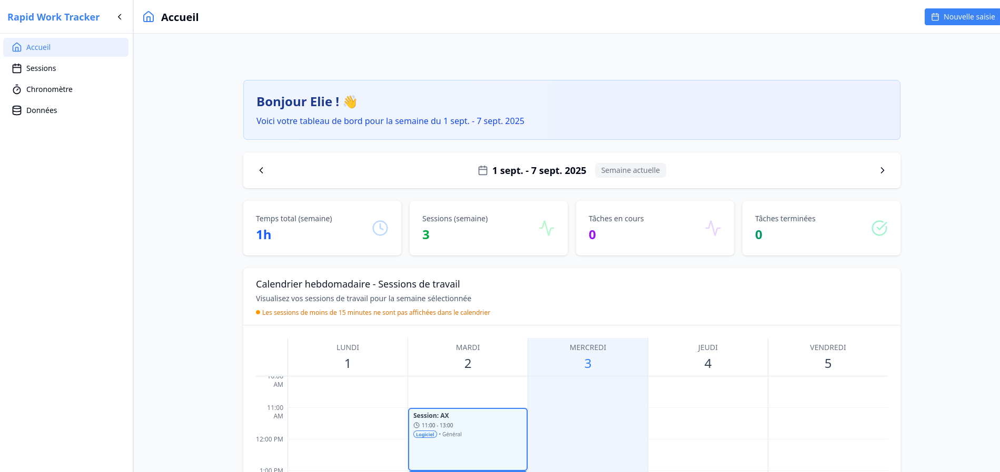

# 🚀 Rapid Work Tracker

A modern time tracking application built with AdonisJS, React, and TypeScript in a Turborepo monorepo structure.

## Preview



## 🎯 Overview

Rapid Work Tracker is a comprehensive time tracking solution that helps teams and individuals monitor their work sessions across different domains and projects. The application features a weekly calendar view, automatic versioning, and containerized deployment.

## ✨ Features

- **📅 Weekly Calendar View**: Visual time tracking with color-coded domains
- **⏱️ Session Management**: Start, stop, and track work sessions
- **🏷️ Domain Organization**: Organize work by domains and subdomains
- **👤 User Authentication**: Secure login and session management
- **📊 Time Analytics**: Track and analyze time spent on different activities
- **🔄 Automatic Versioning**: GitLab CI/CD with semantic versioning
- **🐳 Containerized Deployment**: Docker-based production deployment

## 🏗️ Architecture

This monorepo includes the following packages and applications:

### Core Technologies

- **Backend**: [AdonisJS 6](https://adonisjs.com/) with TypeScript
- **Frontend**: [React](https://reactjs.org/) with [Inertia.js](https://inertiajs.com/)
- **Database**: PostgreSQL with Lucid ORM
- **Styling**: [Tailwind CSS](https://tailwindcss.com/)
- **Build Tool**: [Vite](https://vitejs.dev/)
- **Authentication**: Session-based with middleware
- **Deployment**: Docker containers with automatic versioning

### Apps and Packages

- `rapidwork-web`: Main [AdonisJS](https://adonisjs.com/) application with [Inertia.js](https://inertiajs.com/) and React frontend
- `domain-rapid-work`: Core domain logic and business rules package
- `docs`: Documentation and guides for the project

## ℹ️ About the project and ongoing refactor

This project originally started with a front-end built using Lovable (an AI/low-code platform). However, I was not satisfied with the generated code nor with the experience of iterating between my own code and that produced by an AI/low-code tool. As a result, I decided to refactor everything, especially the front-end, to ensure a healthy, maintainable, and scalable codebase.

### Ongoing front-end refactor includes:
- **Refactoring**: moving some components, removing dead code.
- **Documentation**: I am translating technical documentation to English.
- **Time and date management**: a more robust and centralized approach.
- **Geolocation handling**: displaying dates and durations in the correct format based on user location.
- **Internationalization**: multi-language support is being integrated.
- **Testing**: I will be adding tests progressively. Currently, there are only business logic tests for the domain layer.

> **Work In Progress**: The project is currently being refactored. A deployed version will be available soon.

## 🚀 Quick Start

### Prerequisites

- Node.js 24+ and pnpm
- PostgreSQL database
- Docker (for deployment)

### Development Setup

```bash
# Clone the repository
git clone <repository-url>
cd rapid-work-tracker-monorepo

# Install dependencies
pnpm install

# Setup environment
cp apps/rapidwork-web/.env.example apps/rapidwork-web/.env

# Run migrations
cd apps/rapidwork-web
node ace migration:run

# Start development server
pnpm dev
```

The application will be available at `http://localhost:3333`

## 📚 Technical Documentation

For comprehensive technical information, please refer to our documentation:

- **[📚 Technical Overview](./docs/technical-overview.md)** - Complete technical documentation index
- **[� Getting Started](./docs/getting-started.md)** - Detailed setup and development guide
- **[🏗️ Architecture](./docs/architecture.md)** - System architecture and design decisions
- **[🛠️ Development Guide](./docs/development.md)** - Development practices and tools
- **[🧪 Testing Guide](./docs/testing.md)** - Testing strategy and commands
- **[🚀 Deployment Guide](./docs/deployment-guide.md)** - Production deployment and CI/CD

### Component Guides
- **[📅 WeeklyCalendar Component](./docs/composants/WeeklyCalendar-Guide.md)** - Usage guide for the calendar component
- **[🌍 English Documentation](./docs/)** - English versions available

### Workarounds
- **[🔧 Tuyau Type Generation](./docs/workarounds/tuyau/README.md)** - Required workaround for custom controller structure

## 📄 License

This project is licensed under the MIT License.

## 🔗 Useful Links

**Framework Documentation:**
- [AdonisJS Documentation](https://docs.adonisjs.com/)
- [Inertia.js Documentation](https://inertiajs.com/)
- [React Documentation](https://reactjs.org/docs/)
